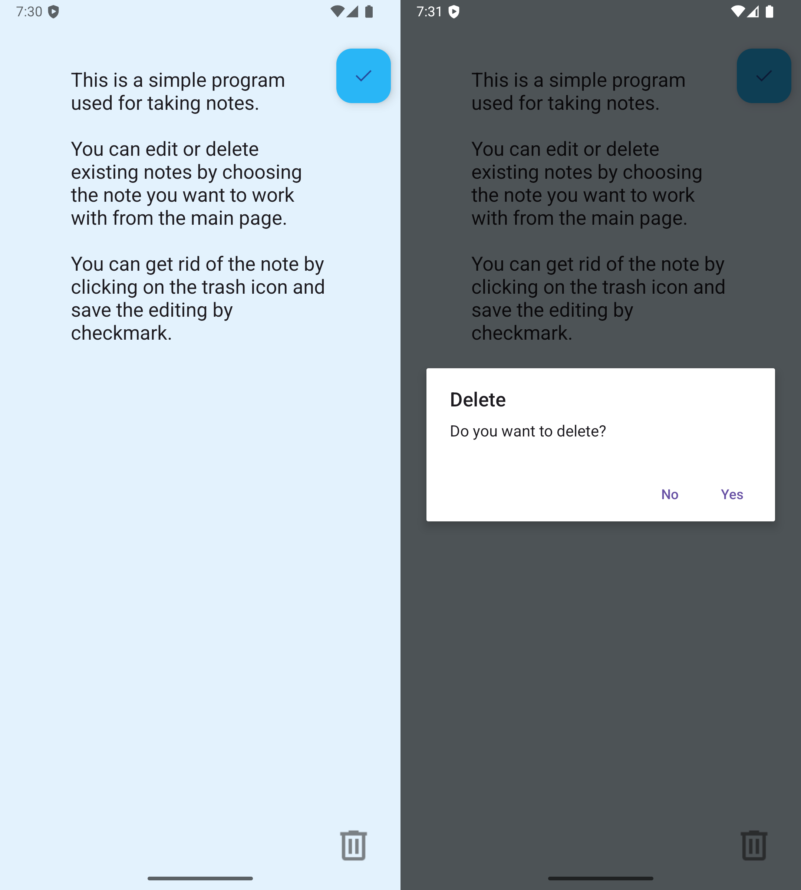

## 📠NoteIt

NoteIt is a simple note-taking Android app created as part of a tutorial and Udemy-based learning journey. It is one of my early projects to explore multiple activities, passing data with Intents, basic CRUD operations, and working with custom adapters and internal file storage.

---

## 🔧 Features

- Add, edit, and delete simple text-based notes  
- View a list of saved notes (first line displayed as a preview)  
- Use of custom adapter (`NoteAdapter`) to display note previews  
- Pass data between `MainActivity` and `SecondActivity` using Intent extras  
- Persist notes using internal storage via object serialization (`FileHelper`)  

---

## 🔎 What I Practiced

- Navigating between multiple activities  
- Using Intent to pass and return data  
- Implementing a custom `ArrayAdapter`  
- Practicing file-based persistence (saving and loading `ArrayList<String>`)  
- Handling `onActivityResult()`  
- Displaying dialogs for delete confirmation  

---

## ⚙️ Tech Stack

- Java  
- Android SDK  
- XML (UI layouts)  
- Material Design components  

---

## 🧠 Lessons Learned

This project helped me better understand the Android Activity lifecycle, working with lists, my first experience with CRUD, and the basics of saving data persistently. It laid the foundation for building more dynamic apps in the future.

---

## 📌 Note

**This app is built mainly for learning purposes. It doesn't use a database like Room or advanced architecture patterns yet—but it's a solid step into Android development.**